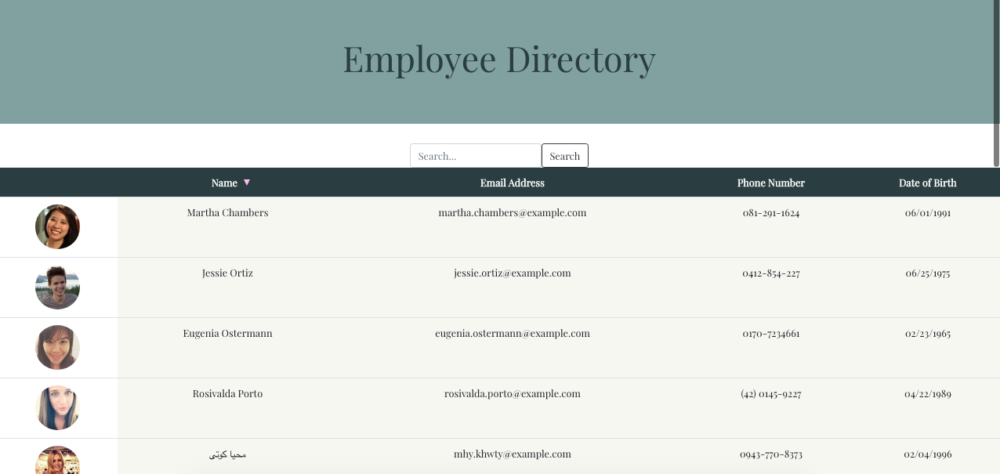

# Employee Directory

An employee directory with React.

## User Story

* As a user, I want to be able to view my entire employee directory at once so that I have quick access to their information.

## Installation
### To run locally:
In the project directory, you can run:

### `npm start`

Runs the app in the development mode. 
Open [http://localhost:3000](http://localhost:3000) to view it in the browser.

## Domains
* Employee Directory is currently being hosted on [Heroku](https://heroku.com/) at https://employee-directory-129.herokuapp.com/

## Built with:
* This project was bootstrapped with [Create React App](https://github.com/facebook/create-react-app).
* [React](https://reactjs.org/)
* [Bootstrap](https://getbootstrap.com/)

## Contact
#### Email
* brittanie.boyko@gmail.com
